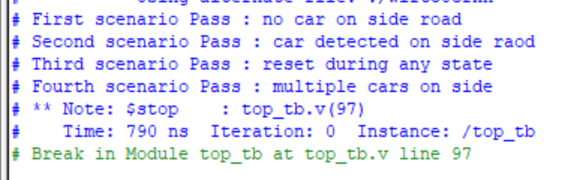
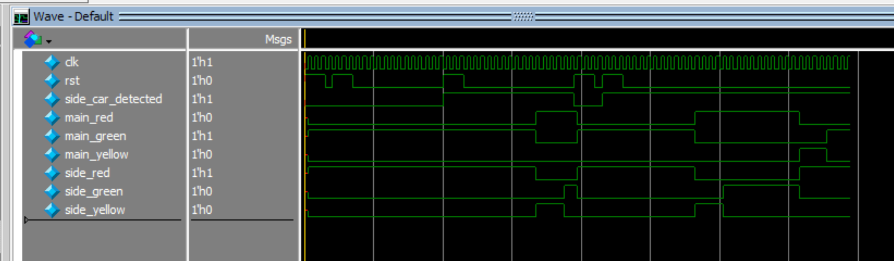
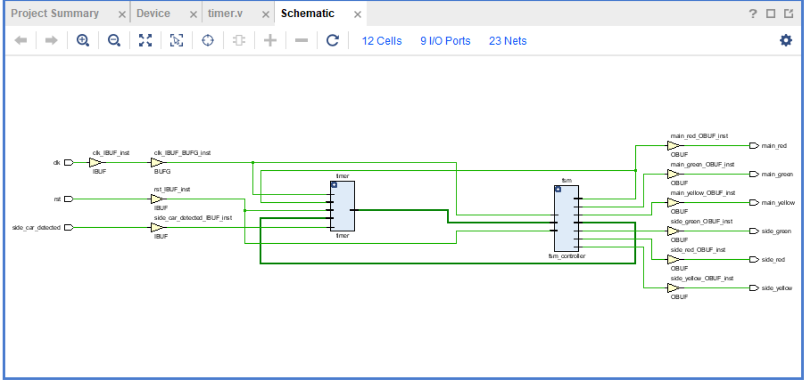
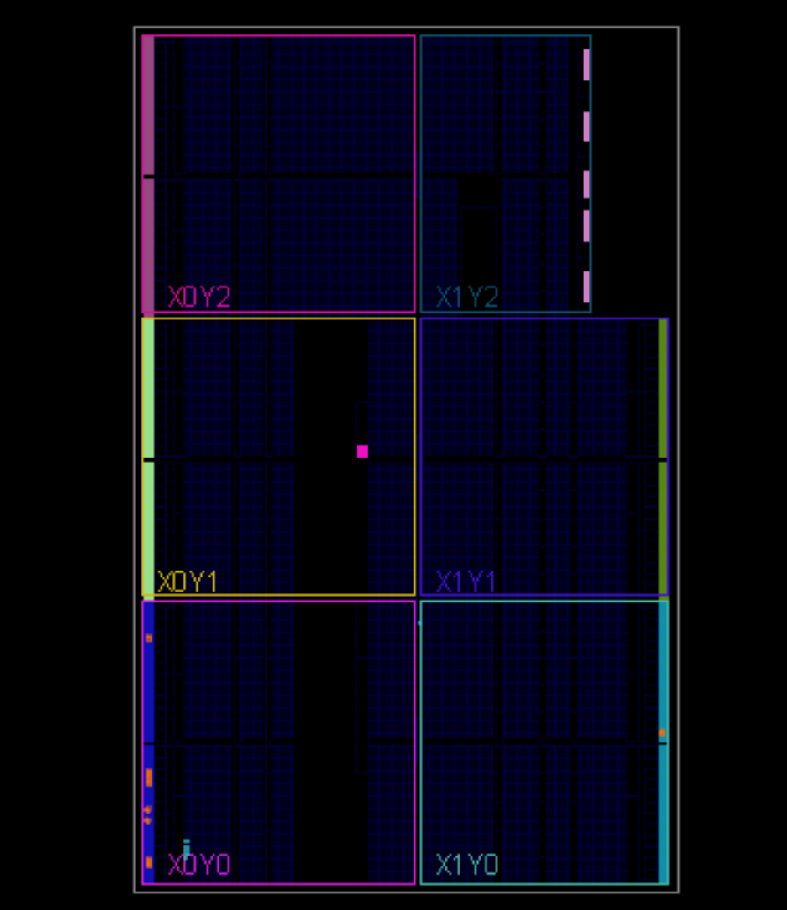

# 🧠 Traffic Light Controller   

This device implements a smart *Traffic Light Controller*. The design is written with *Verilog HDL*, tested with **QuestaSim**, synthesized and implemented using **Xilinx Vivado**, and finally deployed to an **FPGA Board**  

---   

## 📚 Table of Contents  

- [Project Features](#-project-features)
- [Folder Structure](#-folder-structure)
- [Testbench & Simulation](#-testbench--simulation)
- [FPGA Synthesis & Implementation](#-fpga-synthesis--implementation)
- [FPGA Deployment](#fpga-deployment)
- [Tools Used](#-tools-used)
- [How to Run](#-how-to-run)
- [Author](#-author)
- [Notes](#-notes)  

---   

## 📌 Project Features  

- ✅ *Fully Synchronous FSM-based Traffic Light Controller* :   
    Designed usin a FSM with four main states representing traffic signal combinations.  
- 🕒 *Configurable Timing* :   
    Green and yellow signal furations are fully parameterized via parameters:
    `green_signal_lifetime`   
    `yellow_signal_lifetime`.   
- 📶 *Side Road Detection Logic*   
    The controller only transitions to allow side road traffic if a vehicle is detected and the green time for the main road has elapsed.  
- 🧠 *Gray-coded State Code* :   
    Reduces glitching and improves transition reliability.  
- 🔄 *Edge-sensitive State Transition & Timeout Logic* :    
    Clean synchronization between FSM state transitions and the timer module to avoid race conditions.   
- ✅ *Successfully Synthesized & Implemented* :     
    Verified through **Vivado** synthesis and implementation without timing violations.   
- 🧪 *Comprehensive Testbench* :    
    Includes a robust testbench with four realistic scenarios:   
        = No car on side road.   
        = Car detected on side road.    
        = Reset in any state.   
        = Multiple cars detected continously.    
- 📂 *Well-structured Git Repository*      

---   

## 📁 Folder Structure  

| Folder               | Description                                                         |
|----------------------|---------------------------------------------------------------------|
| RTL/                 | Verilog HDL files (fsm_conroller, timer, top_module)                |
| TB/                  | Testbench files for simulation                                      |
| Simulation/          | .do files and simulation scripts for QuestaSim                      |
| FPGA_Implementation/ | Vivado project files and constraint files                           |
| Docs/                | Screenshots, schematics, and simulation outputs                     |   

---   

## 🧪 Testbench and Simulation   

- top_tb.v : verifies rull functionality of this **Traffic Light Controller**, covering four scenarios.   
### ✅ This is the simulation output :     
    
### ✅ Waveform : 
    

---   

## 🧩 FPGA Synthesis & Implementation  

Synthesis and implementation were performed successfully using *Vivado*.  

### 🧠 Schematic View  
  

---

## 🚀 FPGA Deployment  

The processor was programmed onto an FPGA board and verified to run correctly.  

  

---    

## 📥 How to Run 

### 🔬 Simulation:  
1. Open **QuestaSim**  
2. Navigato to the `transcript` 
3. Run using .do file: write `do top.do` to compile and simulate 

### 💡 FPGA:  
1. Open **Vivado Project** `FPGA_Implementation/Traffic_Ligt_Controller.xpr`  
2. Synthesize, implement, and generate bitstream  
3. Program your FPGA board and observe results  

--- 

## 👨‍💻 Author 

**Kareem Ashraf**  
Electronics and Communications Engineering, Cairo University   
📧 **Email**   : [kareem.ash05@gmail.com]   
🔗 **Linkedin** : [www.linkedin.com/in/kareem-ashraf-9aba48348]  
🔗 **GitHub**   : [https://github.com/kareem05-ash]  

---   

## 📌 Notes  

- This project was part of our **Self-learning Journey** 
